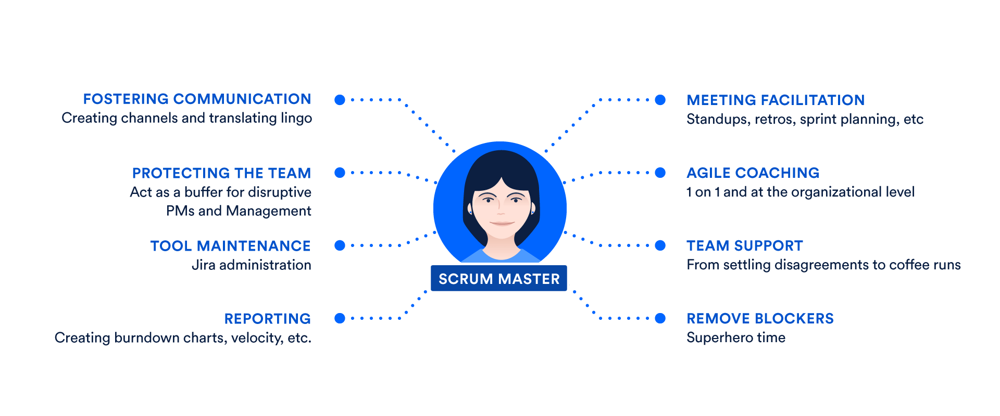

## Scrum Master

**Summary:** The scrum master helps to facilitate scrum to the larger team by ensuring the scrum framework is followed. He/she is committed to the scrum values and practices, but should also remain flexible and open to opportunities for the team to improve their workflow.

As the title implies, the scrum master is the master of scrum, who ensures the scrum framework is followed. Scrum has a clearly defined set of roles and rituals that should be followed and the scrum master works with each member of the scrum team to guide and coach the team through the scrum framework.

<!--  -->
 
<!--  -->

### What is a scrum master?
Scrum masters are the facilitators of scrum, the lightweight agile framework with a focus on time-boxed iterations called sprints. As facilitators, scrum masters act as coaches to the rest of the team. “Servant leaders” as the Scrum Guide puts it. Good scrum masters are committed to the scrum foundation and values, but remain flexible and open to opportunities for the team to improve their workflow.

<!--  -->
 
<!--  -->

### Scrum master responsibilities

Standups, Sprint reviews, Retrospectives, Board administration, 1 on 1s, Internal Consulting, Reporting, Blockers, Busy work

In the ideal agile world, a team would manage its own processes and tools. Yet we’ve found that many teams making the leap to agile often rely on the scrum master as the owner of their process. It takes time for responsibility and authority to diffuse through a team. 

In this transformative context, the role can be as lightweight as scheduling the scrum ceremonies or as involved as any other scrum team member. Although the Scrum Guide lists how the scrum master serves other scrum roles, this is not an exhaustive list of responsibilities. Indeed, we find scrum masters often perform some or all of the following, not all of which are defined by scrum:

**Standups:** Facilitate daily standups (or the daily scrum) as needed.
Iteration/sprint planning meetings – Protect the team from over-committing and scope creep. Aid in estimation and sub task creation.

**Sprint reviews:** Participate in the meeting and capture feedback.

**Retrospectives:** Note areas for improvement and action items for future sprints.

**Board administration:** Work as the administrator of the scrum board. Ensure that cards are up to date and the scrum tool, Jira software or otherwise, is working well.

**1 on 1s:** Meet individually with team members and stakeholders as needed. Iron out team disagreements about process and work styles. While many scrum practitioners are anti-1on1, as they believe these communications should happen during standups, some teams, particularly for new teams, prefer to have these regular face-to-face interactions with specific team members. The scrum master may decide that these individual interactions are crucial for team development and getting to know one another.

**Internal Consulting:** Scrum masters should be prepared to consult with team members and internal stakeholders on how best to work with the scrum team.

**Reporting:** Regular analysis of burndown charts and other portfolio planning tools to understand what gets built and at what cadence.

**Blockers:** The scrum master aids the team by eliminating external blockers and managing internal roadblocks through process or workflow improvements.

**Busy work:** If the scrum team isn’t humming, that’s the scrum master’s problem. Maybe that means fixing broken computers, moving desks around, or even adjusting the thermostat. Scrum masters should be comfortable doing just about anything to help their team and should be not slink away from grabbing coffees or some snacks if that’s what the team really needs.

<!--  -->
 

 
<!--  -->

### Do I need a scrum master?

Any scrum trainer will teach that a scrum team must have a scrum master. Without one, you are doing something just shy of true scrum, often called scrum-but.

When starting out with scrum, it can be a huge help to have someone in the role who has seen scrum working before. Better yet, has seen many examples of it working. For this reason, scrum masters are often hired as consultants, rather than as full-time employees.

But every scrum team is different. Many experienced teams handle the responsibilities listed above as a unit, and take pride and enjoyment in a shared management of the process. The role of scrum master rotates through the team, with team members facilitating standups and retros in turn.

And for some teams, the right thing is just to have the same person play the role every day.

Unfortunately, misunderstanding of the scrum master role often leads existing managers to assume it is their role. To better understand why this can be a problem, let’s compare the scrum master to non-scrum roles you may already have in your organization, and why it's important to keep the role separate.

<!--  -->
 

 
<!--  -->

### Scrum master vs. product manager

As we advocate in our <i style='text-decoration: underline' title='Product management is an organizational function that guides every step of a product’s lifecycle'>Agile Product Management overview</i>, the more involved that a product manager is with the development team, the better. That involvement should be along the lines of a product owner who champions customer needs, the "why" of the product. When the involvement blurs into tasking, the "how" for a team, then there is a problem. Even with the best of intentions, this kind of utilization mindset tends to hide problems: defects, hand-offs, and unknowns. Interleaving scope and process tends toward locking scope, schedule, and quality. That's a recipe for failure.

That's why the scrum master and product owner fill two different needs on a scrum team, that are often combined with traditional software management. And it's tempting in small teams to avoid the perceived overhead of another role. However, when roadblocks crop up, or changes arise, a clear division between process management and product direction is required. 

> _Having a scrum master in place helps balance the cost of changing course with the benefits of efficiency. A good scrum master does this by empowering the team to decide how to best accomplish goals through self-organization._

<!--  -->
 

 
<!--  -->

### Scrum master vs. project manager

The scrum master’s non-technical (or non-agile) counterpart is the project manager. Both of these roles focus on the “how” of getting work done and solve workflow problems through process and facilitation. So do you need both? Likely not.

Both a traditional project manager and a scrum master are responsible for helping their teams get work done, but their approaches are vastly different. The project manager sets and tracks timeframes and milestones, reports on progress, and coordinates team communication. However, they do so from a place of control, in a more traditional management role.

The scrum master helps the team enhance and streamline the processes by which they achieve their goals. They do so as a team member, or collaborator, ideally not as someone in control. The best scrum teams are self-organizing, and therefore don’t react well to top-down management.

These are just a few of the possible configurations of scrum team management. Some organizations make due with all of these roles, some have one or none.

<!--  -->
 

 
<!--  -->

### Scrum masters and the greater org

There is one consideration that rises above the rest when thinking about hiring a scrum master: Only do so if your organization is committed to scrum, and invested in the process. All the above roles can manage a development team in a myriad of ways but a scrum master can only be effective with 100% buy-in on scrum. Full stop.

With a scrum master helping every team manage their process, your entire organization can realize some serious gains. On top of shipping value to your customers on a regular basis (the main goal of scrum), teammates and managers will be free to focus on what they do best. Product managers can focus on strategy, developers can write their best code, and Kyle from sales can ring that damn bell. What does that all sound like? It sounds like high-functioning scrum, music to our ears.